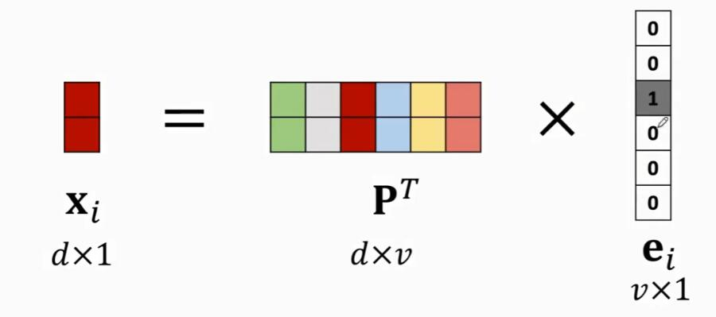

# Natural Language Processing

## Text Processing and Word Embedding

### Text to Sequence

#### Step 1: Tokenization

Breaks a piece of texts down into a list of tokens. 

> text[i] = "... to be or not to be..."
> |
> \/
> tokens[i] = [..., "to", "be", "or", "not", "to", "be", ...]

- Considerations:
  - Upper case to lower case? (eg. "Apple" and "apple")
  - Remove stop words (eg. "a", "the", etc.)
  - Typo correction (eg. "goood" to "good")

#### Step 2: Build Dictionary

Use a dictionary or hash table to count word frequencies.

> tokens[i] = [..., "to", "be", "or", "not", "to", "be", ...]
> |
> \/
> token_index[i] = {"to": 1, "be": 2, "or": 3, "not": 4, ...}

Then encoding

> sequences[i] = [..., 1, 2, 3, 4, 1, 5, ...]

#### Step 3: One-Hot Encoding

#### Step 4: Align Sequences

**Problem**: training samples are not aligned cause they have different length

**Solution**: 

- Cut off the texts to keep same length.
- If the text is too short, pad with zeros(null).

### Word Embedding: word to vector

#### One-Hot Encoding

First, represent words using one-hot vectors.

| Word    | Index | One-Hot vector            |
| ------- | ----- | ------------------------- |
| "movie" | 1     | $e_1$ = [1, 0, 0, ..., 0] |
| "good"  | 2     | $e_2$ = [0, 1, 0, ..., 0] |
| "fun"   | 3     | $e_3$ = [0, 0, 1, ..., 0] |
| ...     | ...   | ...                       |

#### Word Embedding

Second, map the one-hot vectors to low-dimensional vectors by a parameter matrix P, which can be learned from training data.

### Logistic Regression for Binary Classification

- seqs[i] : [27, 28, 29, 30, ..., 41, 42] (lens = 20)
  - *Embedding Layer*
- X[i] : word_num $\times$ embedding_dim (20 $\times$ 8) **matrix**
  - *Flatten Layer*
- x[i] : 160-dim **vector**
  - *Logistic Regression*
- f[i] : **Binary Predication** (positive or negative)

## Recurrent Neural Networks (RNNs)

### Model Sequential Data

### RNN

### Simple RNN

$h_t=\tanh(A\cdot (h_{t-1}X_t))$

- Hidden state $h_t$ contains all information from $X_1$ to $X_t$.

### Shortcomings of SimpleRNN

- good at short-term dependence
- bad at long-term dependence
